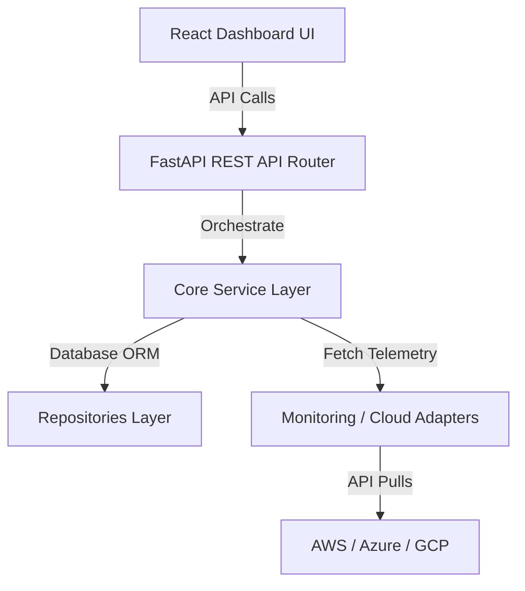

# CloudPilot AI: Enterprise Multi-Cloud FinOps & DevOps Copilot

CloudPilot AI is a production-grade, dark-mode-first multi-cloud FinOps dashboard and DevOps optimization engine designed to aggregate resources, scrape metrics, generate right-sizing recommendations, and support secure AI chat agent queries across AWS, Azure, and Google Cloud (GCP).

---

## 1. System Architecture

CloudPilot AI follows Clean Architecture and SOLID design patterns, completely separating target integrations from internal orchestration services:



For comprehensive sequence and entity schemas, see the [Architecture & Design Handbook](file:///d:/Devops/Cost%20detector/docs/architecture_handbook.md).

---

## 2. Technology Stack

* **Backend API:** FastAPI (Uvicorn), SQLAlchemy (Asyncpg), Alembic, Pydantic v2
* **Background Tasks:** Celery, Redis Broker
* **Database & Caches:** PostgreSQL, Redis
* **Frontend Web Dashboard:** React 19, Vite, TypeScript, TailwindCSS, TanStack React Query, Recharts, Lucide Icons
* **Infrastructure & IaC:** Terraform, Kubernetes YAML, Helm Charts, ArgoCD Application configs
* **CI/CD Pipelines:** GitHub Actions, Trivy Security Scopes

---

## 3. Directory Structure

```
CloudPilot AI/
├── backend/                  # FastAPI REST API & Celery Worker backend
│   ├── app/                  # Main server codebase
│   └── tests/                # Pytest suites
├── frontend/                 # React Web UI
│   ├── src/                  # React components & hooks
│   └── public/               # Static assets
├── kubernetes/               # Kubernetes Deployment manifests & ArgoCD configurations
├── helm/                     # Cloud-agnostic Helm deployment charts
├── terraform/                # Infrastructure provisioning scripts (AWS, Azure, GCP)
└── docs/                     # Architecture & operations manuals
```

---

## 4. Setup & Launching Locally

### Step 1: Clone and Start Containers
Launch all containers (FastAPI, React Web, Celery Worker, PostgreSQL, Redis, Prometheus, Grafana) from the root folder:
```bash
docker-compose up --build
```

### Step 2: Access Endpoints
* **Web UI Dashboard:** [http://localhost](http://localhost)
* **REST API swagger docs:** [http://localhost:8000/docs](http://localhost:8000/docs)
* **Prometheus Targets:** [http://localhost:9090](http://localhost:9090)
* **Grafana Dashboard:** [http://localhost:3000](http://localhost:3000)

---

## 5. Deployment Guide

### A. Deploying via Helm
Install the cloud-agnostic Helm chart into your Kubernetes cluster:
```bash
helm upgrade --install cloudpilot-release helm/cloudpilot-ai -f helm/cloudpilot-ai/values.yaml
```

### B. Deploying via ArgoCD
Apply the ArgoCD application layout:
```bash
kubectl apply -f kubernetes/argocd-app.yaml
```

---

## 6. Environment Variables

* `DATABASE_URL`: Asynchronous DB connection link (`postgresql+asyncpg://...`).
* `REDIS_URL`: Redis brokerage queue URL.
* `ENCRYPTION_KEY`: AES GCM credentials decryption key.

---

## 7. License
Licensed under the Apache License, Version 2.0. See [LICENSE](LICENSE) for details.
