# CloudPilot AI: Architecture & Design Specification
## Enterprise-Grade Multi-Cloud DevOps Copilot

---

## Document Metadata
* **Author:** Principal Software Architect & Senior DevOps Engineer
* **Status:** Draft / Pending Review
* **Target Audience:** Engineering, DevOps, and Security Teams
* **Version:** 1.0.0

---

## Table of Contents
1. [Executive Summary](#executive-summary)
2. [High-Level System Architecture](#1-high-level-system-architecture)
3. [Low-Level Architecture & Modular Breakdown](#2-low-level-architecture--modular-breakdown)
4. [Complete Folder Structure](#3-complete-folder-structure)
5. [Component Diagram](#4-component-diagram)
6. [Data Flow Sequence Flows](#5-data-flow-sequence-flows)
7. [Cloud Provider Abstraction Interface](#6-cloud-provider-abstraction-interface)
8. [Monitoring Provider Abstraction Interface](#7-monitoring-provider-abstraction-interface)
9. [Normalization Layer Specification](#8-normalization-layer-specification)
10. [Optimization Engine Architecture](#9-optimization-engine-architecture)
11. [AI Engine Architecture & Isolation Boundary](#10-ai-engine-architecture--isolation-boundary)
12. [Security & Compliance Architecture](#11-security--compliance-architecture)
13. [Scalability & Infrastructure Strategy](#12-scalability--infrastructure-strategy)
14. [Technology Decision Rationale](#13-technology-decision-rationale)
15. [Future Extension Handbooks](#14-future-extension-handbooks)

---

## Executive Summary

CloudPilot AI is a production-grade, cloud-agnostic, AI-powered DevOps Copilot designed to discover resources, monitor metrics, collect billing/pricing data, and generate optimization recommendations across multi-cloud environments. 

### Core Design Philosophy
* **Decoupled Isolation (Clean Architecture):** The core business logic, optimization engine, and AI assistant are completely decoupled from external cloud and monitoring provider APIs.
* **Provider Abstraction via Adapter Pattern:** Cloud and monitoring APIs are wrapped behind standardized interfaces, enabling clean extensibility without code modifications in the core domain.
* **Secured AI Sandbox:** The AI Engine never communicates directly with cloud endpoints or executes commands. It operates exclusively on normalized, sanitised metadata stored in internal databases.
* **Enterprise Security First:** Credentials are encrypted at rest using envelope encryption (with KMS/Vault integration), audit trails are immutable, and role-based access control (RBAC) dictates resource boundaries.

---

## 1. High-Level System Architecture

CloudPilot AI is structured using **Clean Architecture** principles, enforcing dependency flow from outer rings (interfaces/adapters) to the inner core (entities/use cases).

```
    ┌─────────────────────────────────────────────────────────┐
    │                   Outer Ring: Adapters                  │
    │  (FastAPI Controllers, Cloud Adapters, Celery Workers)  │
    │                            ▼                            │
    │         ┌─────────────────────────────────────┐         │
    │         │      Middle Ring: Use Cases         │         │
    │         │ (Billing Engine, Optimization Eng)  │         │
    │         │                  ▼                  │         │
    │         │   ┌─────────────────────────────┐   │         │
    │         │   │     Inner Ring: Entities    │   │         │
    │         │   │     (Normalized Models)     │   │         │
    │         │   └─────────────────────────────┘   │         │
    │         └─────────────────────────────────────┘         │
    └─────────────────────────────────────────────────────────┘
```

### Major Component Responsibilities

1. **API Gateway (Nginx / Cloud Load Balancer):** Handles SSL termination, routes requests to FastAPI instances, manages static asset hosting, and enforces global rate-limiting.
2. **FastAPI Application Server:** Exposes RESTful and WebSocket endpoints. It handles request validation, authentication checks, orchestration of use cases, and triggers background jobs.
3. **Authentication Module:** Manages JWT creation, validation, sliding refresh tokens, and enforces Role-Based Access Control (RBAC).
4. **Provider Manager:** Resolves the appropriate Cloud Provider Adapter using a Factory pattern to fetch resource catalogs, cost data, and configurations.
5. **Monitoring Manager:** Resolves appropriate monitoring adapters (Datadog, Prometheus, etc.) to query normalized performance metrics (CPU, Memory, IOPS).
6. **Billing & Pricing Engine:** Collects multi-cloud billing exports, ingests public cloud pricing tables, resolves actual costs, and formats data for cost reports.
7. **Normalization Layer:** Formats heterogenous data payloads from various cloud/monitoring APIs into uniform internal schemas.
8. **Optimization Engine:** A decoupled, deterministic rule engine that analyzes normalized resource metadata and performance metrics to generate cost-saving recommendations.
9. **AI Engine:** Orchestrates Large Language Models (LLMs) via OpenRouter, Ollama, or OpenAI. It builds highly contextual, sanitised prompts using DB records to answer natural language queries.
10. **Celery Worker Pool / Scheduler:** Executes asynchronous, long-running tasks like resource syncs, metric collections, and cost forecasting jobs.
11. **PostgreSQL Database:** Primary persistent store for RBAC, user management, cloud credentials (encrypted), normalized resource metadata, billing data, recommendations, and audit logs.
12. **Redis Cache & Broker:** Serves as the high-performance broker for Celery queues, handles API rate-limiting trackers, and caches volatile query results.
13. **React Vite Frontend:** Premium TypeScript single-page application (SPA) displaying charts, tables, interactive chat interface, and provider management configuration.

---

## 2. Low-Level Architecture & Modular Breakdown

The system is decomposed into self-contained modules, each adhering to the Single Responsibility Principle (SRP) and communicating via Dependency Injection (DI).

```
   ┌─────────────────────────────────────────────────────────────────────────┐
   │                            cloudpilot-core                              │
   ├───────────────┬─────────────────┬──────────────────┬────────────────────┤
   │  auth_domain  │ resource_domain │  billing_domain  │ optimization_domain│
   ├───────────────┼─────────────────┼──────────────────┼────────────────────┤
   │   ai_domain   │   jobs_domain   │ telemetry_domain │  shared_library    │
   └───────────────┴─────────────────┴──────────────────┴────────────────────┘
```

### Submodule Specification

* **`cloudpilot.core.auth`**:
  * `token_service`: Generates, verifies, and revokes JWT/refresh tokens.
  * `user_service`: Implements CRUD for users, password hashing (bcrypt), and profile updates.
  * `rbac_policy`: Evaluates permissions using database-defined policies.
* **`cloudpilot.core.resources`**:
  * `registry`: Manages tenant-specific cloud integrations and credentials validation.
  * `discovery_orchestrator`: Dispatches parallel Celery discovery tasks per connected account.
  * `repository`: Data access object (DAO) for writing/reading normalized resources.
* **`cloudpilot.core.billing`**:
  * `billing_collector`: Triggers syncs of billing manifests (AWS CUR, Azure Cost Export).
  * `pricing_catalog`: Maintains and queries a local copy of multi-region compute/storage pricing tables.
  * `cost_analyzer`: Calculates historical spending patterns and cost distributions.
* **`cloudpilot.core.optimization`**:
  * `rule_engine`: Evaluates a registry of active rules against normalized resources.
  * `rules.compute`: Evaluates CPU utilization trends to find idle/oversized virtual machines.
  * `rules.storage`: Checks storage attachment status, IOPS thresholds, and snapshot ages.
  * `recommendation_registry`: Saves and marks lifecycle changes (active, dismissed, applied) of optimization options.
* **`cloudpilot.core.ai`**:
  * `context_builder`: Formats raw resources and metric summaries into JSON structures fit for LLM prompts.
  * `prompt_registry`: Dynamic repository of system prompts and template contexts.
  * `llm_client`: Universal client wrapper translating core requests into specific provider structures (OpenRouter, Ollama, OpenAI).
* **`cloudpilot.core.jobs`**:
  * `celery_app`: Defines task queues (`default`, `discovery`, `billing`, `ai`).
  * `scheduler`: Crontab schedules triggering daily discoveries and hourly metric syncs.
* **`cloudpilot.core.telemetry`**:
  * `monitoring_orchestrator`: Collects resource metrics from target monitoring endpoints.
  * `metric_repository`: Queries and aggregates historical metrics for the optimization engine.

---

## 3. Complete Folder Structure

Below is the production-grade, enterprise-ready repository directory structure designed for modular packaging and clean deployment.

```
cloudpilot-ai/
├── .github/
│   └── workflows/
│       ├── ci.yml                 # Backend and Frontend lint, test, build checks
│       └── cd.yml                 # Build Docker images, push to registry, deploy
├── docs/
│   ├── architecture_design.md     # This comprehensive design document
│   ├── deployment_guide.md        # Guide for helm-charts and terraform setups
│   └── api_spec.yaml              # OpenAPI 3.0 specification file
├── backend/
│   ├── alembic/                   # Alembic database migrations
│   │   ├── versions/
│   │   ├── env.py
│   │   └── script.py.mako
│   ├── app/
│   │   ├── __init__.py
│   │   ├── main.py                # FastAPI app initialization and setup
│   │   ├── api/                   # Web routing and controller layer
│   │   │   ├── v1/
│   │   │   │   ├── auth.py
│   │   │   │   ├── cloud.py
│   │   │   │   ├── metrics.py
│   │   │   │   ├── recommendations.py
│   │   │   │   └── ai_chat.py
│   │   │   ├── dependencies.py    # FastAPI Dependency Injection definitions
│   │   │   └── router.py
│   │   ├── core/                  # Core framework-level configurations
│   │   │   ├── config.py          # Pydantic BaseSettings load from env
│   │   │   ├── database.py        # SQLAlchemy engine and session makers
│   │   │   ├── security.py        # Cryptography, JWT verification, hashing
│   │   │   └── exceptions.py      # Standard app-wide exception definitions
│   │   ├── domains/               # Clean Architecture Domain/Business Logic
│   │   │   ├── auth/
│   │   │   │   ├── models.py      # Database models for user/rbac
│   │   │   │   ├── schemas.py     # Pydantic input/output validation schemas
│   │   │   │   └── service.py
│   │   │   ├── cloud/
│   │   │   │   ├── adapters/      # Adapter Pattern implementations
│   │   │   │   │   ├── base.py    # Abstract base class for cloud providers
│   │   │   │   │   ├── aws.py
│   │   │   │   │   ├── azure.py
│   │   │   │   │   ├── gcp.py
│   │   │   │   │   └── factory.py # Registry and lookup for cloud adapters
│   │   │   │   ├── models.py      # Database model for credentials, accounts
│   │   │   │   ├── schemas.py     # Normalized structures
│   │   │   │   └── service.py
│   │   │   ├── monitoring/
│   │   │   │   ├── adapters/
│   │   │   │   │   ├── base.py    # Abstract base class for telemetry
│   │   │   │   │   ├── prometheus.py
│   │   │   │   │   ├── cloudwatch.py
│   │   │   │   │   ├── azure_monitor.py
│   │   │   │   │   ├── datadog.py
│   │   │   │   │   └── factory.py
│   │   │   │   └── service.py
│   │   │   ├── billing/
│   │   │   │   ├── service.py
│   │   │   │   └── models.py
│   │   │   ├── optimization/
│   │   │   │   ├── engine.py      # Rules engine controller
│   │   │   │   ├── rules/
│   │   │   │   │   ├── base.py    # Base Optimization Rule class
│   │   │   │   │   ├── idle_vm.py
│   │   │   │   │   └── unused_storage.py
│   │   │   │   └── models.py
│   │   │   └── ai/
│   │   │   │   ├── prompt_templates.py
│   │   │   │   ├── client.py      # LLM Gateway interface
│   │   │   │   └── service.py
│   │   │   └── kubernetes/
│   │   │       ├── collector.py
│   │   │       └── service.py
│   │   ├── jobs/                  # Background worker layer (Celery tasks)
│   │   │   ├── tasks/
│   │   │   │   ├── discovery.py
│   │   │   │   ├── billing.py
│   │   │   │   └── optimization.py
│   │   │   └── worker.py          # Celery configuration setup
│   │   └── tests/                 # Complete backend testing suite
│   │       ├── conftest.py
│   │       ├── test_auth.py
│   │       ├── test_cloud_adapters.py
│   │       ├── test_optimization_engine.py
│   │       └── test_ai_sandbox.py
│   ├── alembic.ini
│   ├── pyproject.toml             # Poetry project and dependency file
│   └── poetry.lock
├── frontend/
│   ├── public/
│   ├── src/
│   │   ├── assets/
│   │   ├── components/            # Shared, reusable UI elements
│   │   │   ├── ui/                # Radix UI wrapped using tailwind (shadcn/ui)
│   │   │   │   ├── button.tsx
│   │   │   │   ├── dialog.tsx
│   │   │   │   └── table.tsx
│   │   │   ├── layout/
│   │   │   │   ├── sidebar.tsx
│   │   │   │   └── header.tsx
│   │   │   └── chart.tsx          # Wrapped Recharts components
│   │   ├── features/              # Feature-oriented module design
│   │   │   ├── dashboard/
│   │   │   │   └── components/
│   │   │   ├── integrations/
│   │   │   │   └── components/
│   │   │   ├── billing/
│   │   │   │   └── components/
│   │   │   ├── recommendations/
│   │   │   │   └── components/
│   │   │   └── ai-chat/
│   │   │       ├── components/
│   │   │       └── chat-hook.ts
│   │   ├── hooks/                 # Global React Hooks
│   │   │   ├── use-auth.ts
│   │   │   └── use-api-query.ts   # React Query wrapping fetch/axios endpoints
│   │   ├── services/
│   │   │   └── api-client.ts      # Axios instance configuring JWT attach/refresh
│   │   ├── store/
│   │   │   └── app-store.ts       # Global lightweight state (e.g. Zustand)
│   │   ├── types/
│   │   │   └── index.ts           # Shared TypeScript interfaces matching backend DTOs
│   │   ├── App.tsx
│   │   ├── main.tsx
│   │   └── index.css
│   ├── package.json
│   ├── tsconfig.json
│   ├── tailwind.config.js
│   └── vite.config.ts
├── infrastructure/
│   ├── docker/
│   │   ├── backend.Dockerfile
│   │   ├── frontend.Dockerfile
│   │   └── docker-compose.yml     # Local orchestration for dev (Postgres, Redis, Celery, App)
│   ├── terraform/                 # Terraform plans for cloud hosting (Optional)
│   │   ├── main.tf
│   │   ├── variables.tf
│   │   └── modules/
│   │       ├── database/
│   │       └── compute/
│   └── kubernetes/                # Helm chart for production deployment
│       └── helm-chart/
│           ├── Chart.yaml
│           ├── values.yaml
│           └── templates/
│               ├── app-deployment.yaml
│               ├── worker-deployment.yaml
│               └── postgres-statefulset.yaml
└── .gitignore
```

---

## 4. Component Diagram

The component diagram details logical boundaries, request routes, database mappings, and asynchronous task delivery.

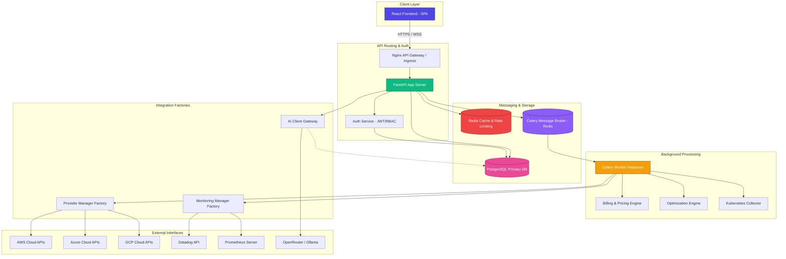

---

## 5. Data Flow Sequence Flows

### 5.1 User Login Flow
Handles user credential authentication and token delivery.

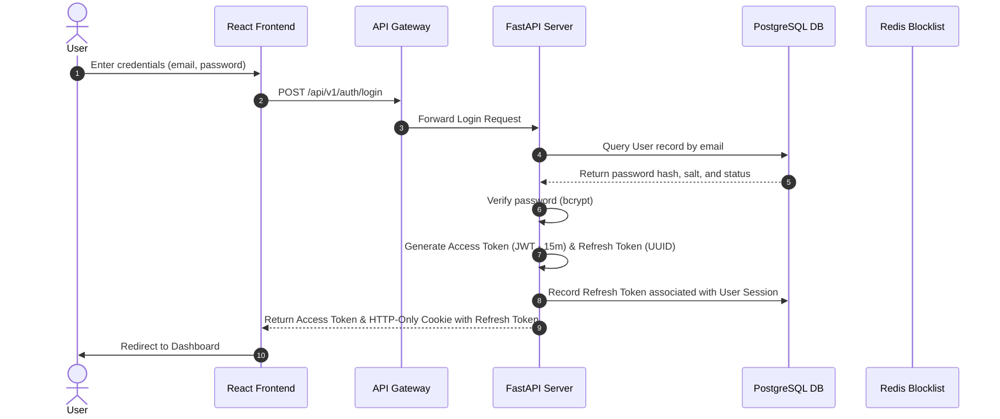

### 5.2 Connect Cloud Account Flow
Creates configuration objects and validates remote account access.

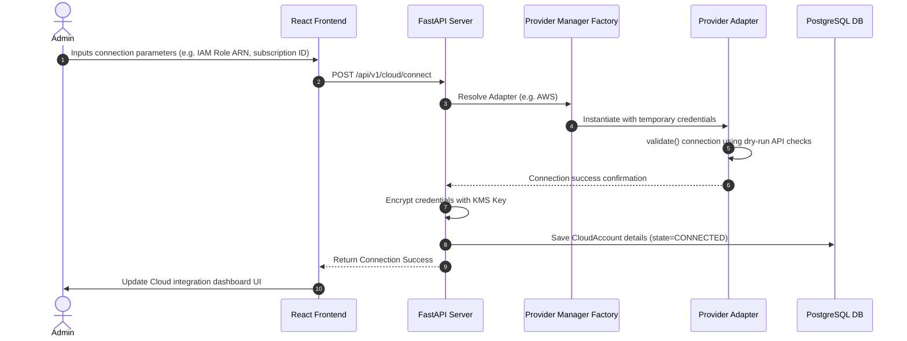

### 5.3 Fetch Resources (Asynchronous Periodic Task)
Discovers configuration items in connected environments.

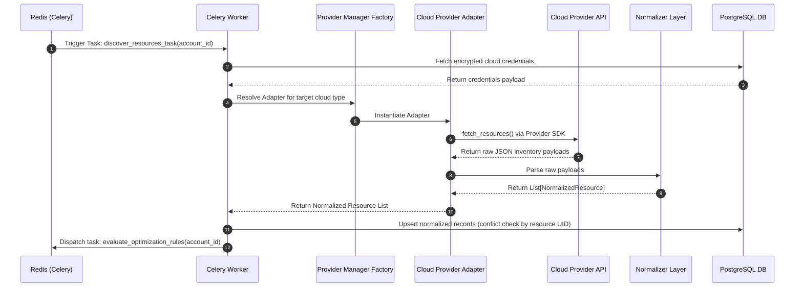

### 5.4 Fetch Billing Manifests
Gathers billing exports to analyze spending.

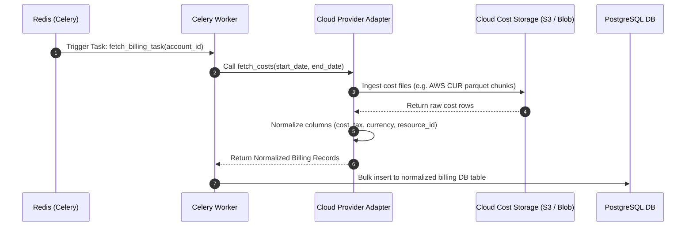

### 5.5 Analyze Metrics Flow
Syncs metric values dynamically to support sizing validation.

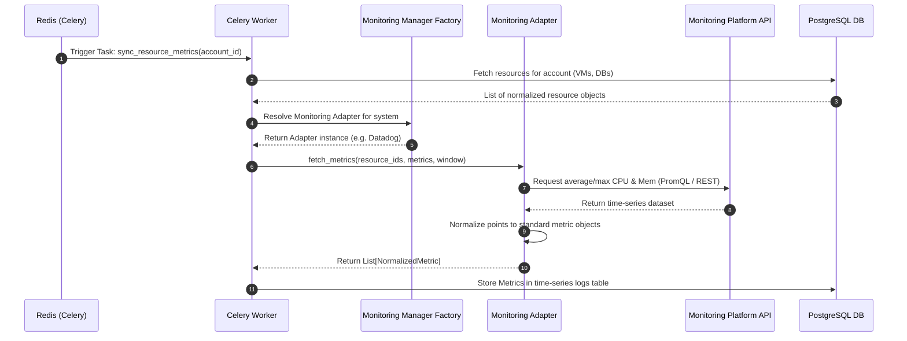

### 5.6 Generate Recommendations Flow
Invokes the rule engine to flag optimization opportunities.

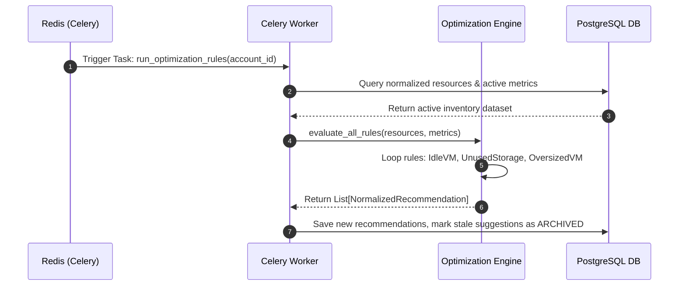

### 5.7 AI Chat Flow
Generates recommendations via context-aware sandboxed chat operations.

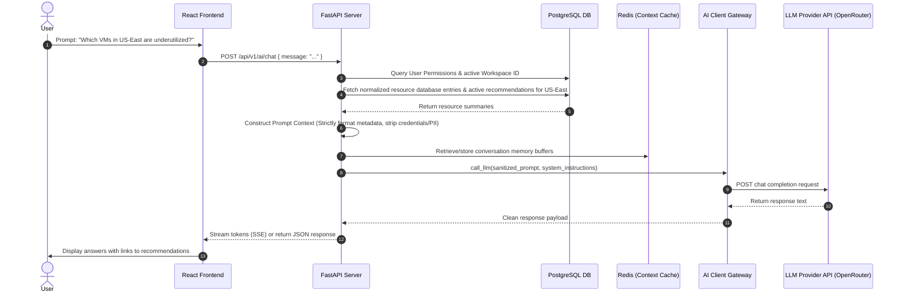

### 5.8 Export Reports Flow
Renders reports dynamically across multi-cloud integrations.

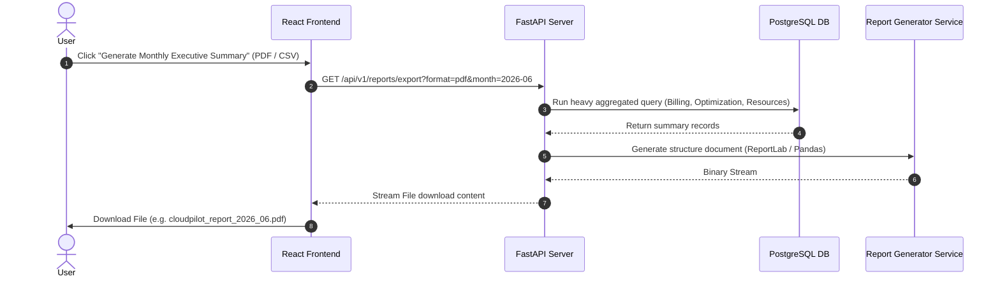

---

## 6. Cloud Provider Abstraction Interface

To provide strict decoupling, the cloud adapters must follow a common interface. The business logic interacts only with the abstract class `CloudProviderAdapter`.

### Python Interface Specification

```python
# File: backend/app/domains/cloud/adapters/base.py

from abc import ABC, abstractmethod
from typing import List, Dict, Any
from pydantic import BaseModel
from app.domains.cloud.schemas import (
    NormalizedResource,
    NormalizedBillingRecord,
    NormalizedPriceRecord
)

class ConnectionConfig(BaseModel):
    """
    Standardized validation schema for establishing remote cloud connections.
    Includes region parameters and dynamic dictionary configurations.
    """
    account_id: str
    provider_name: str
    credentials: Dict[str, Any]  # Stored in vault, injected at runtime
    settings: Dict[str, Any]     # Region exclusions, discovery schedules, etc.


class CloudProviderAdapter(ABC):
    """
    Abstract Base Class enforcing the Interface Contract for all Cloud Adapters.
    New cloud providers must subclass this interface and implement all methods.
    """
    
    @abstractmethod
    def connect(self, config: ConnectionConfig) -> None:
        """
        Initializes cloud provider connection sessions (e.g., establishing boto3 session).
        Raises ConnectionError or AuthError on failure.
        """
        pass

    @abstractmethod
    def validate(self) -> bool:
        """
        Performs basic API checks (e.g. STS GetCallerIdentity) to verify credentials
        validity and correct permissions configurations. Returns True if valid.
        """
        pass

    @abstractmethod
    def disconnect(self) -> None:
        """
        Cleanly tear down connection sessions, API channels, and threads.
        """
        pass

    @abstractmethod
    def fetch_resources(self) -> List[NormalizedResource]:
        """
        Discovers all cloud resources (VMs, DBs, Storage, Load Balancers) 
        and maps them to standard internal NormalizedResource schemas.
        """
        pass

    @abstractmethod
    def fetch_costs(self, start_date: str, end_date: str) -> List[NormalizedBillingRecord]:
        """
        Retrieves cost exports or line items for target dates and maps to normalized format.
        Args:
            start_date: ISO 8601 Date String (YYYY-MM-DD)
            end_date: ISO 8601 Date String (YYYY-MM-DD)
        """
        pass

    @abstractmethod
    def fetch_pricing_catalog(self, service_types: List[str]) -> List[NormalizedPriceRecord]:
        """
        Pulls actual pricing guides and instance retail prices from public lookup structures.
        """
        pass
```

### Factory Architecture pattern
To instantiate adapters without hardcoding them, we use a registry design pattern.

```python
# File: backend/app/domains/cloud/adapters/factory.py

from typing import Dict, Type
from app.domains.cloud.adapters.base import CloudProviderAdapter

class ProviderAdapterFactory:
    """Registry pattern factory for instantiating target CloudProviderAdapters."""
    
    _adapters: Dict[str, Type[CloudProviderAdapter]] = {}

    @classmethod
    def register_adapter(cls, provider_name: str, adapter_class: Type[CloudProviderAdapter]) -> None:
        """Register a new adapter implementation with the factory class."""
        cls._adapters[provider_name.lower()] = adapter_class

    @classmethod
    def get_adapter(cls, provider_name: str) -> Type[CloudProviderAdapter]:
        """Resolve and return an uninstantiated class type based on string names."""
        adapter_type = cls._adapters.get(provider_name.lower())
        if not adapter_type:
            raise NotImplementedError(f"Cloud provider adapter for '{provider_name}' not implemented.")
        return adapter_type
```

---

## 7. Monitoring Provider Abstraction Interface

Metrics are polled asynchronously from monitoring frameworks to analyze size metrics.

### Python Interface Specification

```python
# File: backend/app/domains/monitoring/adapters/base.py

from abc import ABC, abstractmethod
from typing import List, Dict, Any
from pydantic import BaseModel
from app.domains.cloud.schemas import NormalizedMetric


class QueryWindow(BaseModel):
    start_time: int  # Unix timestamp
    end_time: int    # Unix timestamp
    step_seconds: int


class MonitoringAdapter(ABC):
    """
    Abstract Base Class enforcing standard metric querying across APM / Telemetry tools.
    """
    
    @abstractmethod
    def connect(self, connection_details: Dict[str, Any]) -> None:
        """Initialize credentials/endpoint configs for telemetry fetching."""
        pass

    @abstractmethod
    def fetch_resource_metrics(
        self,
        resource_id: str,
        metric_types: List[str],  # CPU, MEMORY, STORAGE_IOPS, NETWORK_THROUGHPUT
        window: QueryWindow
    ) -> List[NormalizedMetric]:
        """
        Fetches metrics dataset for a specific physical resource identification payload
        and transforms it to normalized collections.
        """
        pass
```

### Specific Provider Adapters Implementation Blueprint

The platform must support standard mapping conversions for metric variables:

| Normalized Metric | Prometheus PromQL | AWS CloudWatch Metric | Datadog Query |
| :--- | :--- | :--- | :--- |
| **`CPU_UTILIZATION`** | `node_cpu_seconds_total...` | `AWS/EC2 -> CPUUtilization` | `system.cpu.user` + `system.cpu.system` |
| **`MEMORY_UTILIZATION`** | `(mem_total - mem_free)...` | `CWAgent -> MemoryUtilization` | `system.mem.pct_usable` |
| **`DISK_READ_BYTES`** | `node_disk_read_bytes_total` | `AWS/EC2 -> DiskReadBytes` | `system.io.r_bytes` |

---

## 8. Normalization Layer Specification

A normalization layer is necessary to insulate core application logic from various cloud API payloads.

### Rationale
* **Schema Decoupling:** AWS returns pricing data via highly nested SKU payloads; GCP uses SKUs linked to core Service Categories. Normalization creates a unified schema (`NormalizedPriceRecord`).
* **Simplifying the Optimization Engine:** The rules engine does not need conditional blocks for every instance size type (e.g. `i3.xlarge` vs `Standard_D4s_v5`). Rules read normalized CPU cores, RAM limits, and disk metrics.
* **Efficient UI State:** The frontend components map to standardized fields, preventing duplicate visualization charts for different vendors.

### Python Normalized Model Schemas (Pydantic models)

```python
# File: backend/app/domains/normalization/schemas.py

from enum import Enum
from typing import Dict, Any, List, Optional
from pydantic import BaseModel, Field

class ResourceType(str, Enum):
    VIRTUAL_MACHINE = "virtual_machine"
    DATABASE = "database"
    OBJECT_STORAGE = "object_storage"
    LOAD_BALANCER = "load_balancer"
    CONTAINER_NODE = "container_node"

class MetricType(str, Enum):
    CPU_UTILIZATION = "cpu_utilization"
    MEMORY_UTILIZATION = "memory_utilization"
    DISK_IOPS = "disk_iops"
    NETWORK_THROUGHPUT = "network_throughput"

class RecommendationType(str, Enum):
    RIGHTSIZE = "rightsize"
    TERMINATE = "terminate"
    TIER_MIGRATION = "tier_migration"
    COMMITMENT = "commitment"


class NormalizedResource(BaseModel):
    """Normalized Cloud Resource Schema."""
    resource_id: str = Field(..., description="Unique physical identifier (e.g. ARN, Azure URI)")
    name: str
    resource_type: ResourceType
    provider: str  # "aws", "azure", "gcp"
    region: str
    status: str    # "running", "stopped", "terminated"
    vcpu_count: Optional[int] = None
    memory_gb: Optional[float] = None
    storage_gb: Optional[float] = None
    tags: Dict[str, str] = Field(default_factory=dict)
    raw_payload: Dict[str, Any] = Field(..., description="Raw provider metadata stored for debugging")


class NormalizedMetric(BaseModel):
    """Normalized Time-series metrics data point."""
    resource_id: str
    metric_type: MetricType
    timestamp: int
    value: float
    unit: str  # "percent", "bytes", "ops"


class NormalizedBillingRecord(BaseModel):
    """Unified line item cost record representation."""
    billing_id: str
    resource_id: Optional[str] = None
    provider: str
    account_id: str
    billing_period: str  # e.g., "2026-06"
    cost: float          # Amortized USD amount
    usage_type: str      # "compute-running", "storage-ebs"
    currency: str = "USD"
    timestamp: int


class NormalizedPriceRecord(BaseModel):
    """Standardized price representation matrix."""
    sku: str
    provider: str
    region: str
    service_code: str
    resource_specification: Dict[str, Any]  # Cores, Memory configurations
    unit_price_hourly: float
    currency: str = "USD"


class NormalizedRecommendation(BaseModel):
    """Actionable generated recommendation output."""
    recommendation_id: str
    resource_id: str
    recommendation_type: RecommendationType
    savings_potential_monthly: float
    rule_name: str
    current_configuration: Dict[str, Any]
    target_configuration: Dict[str, Any]
    reasoning: str
    timestamp: int


class NormalizedForecast(BaseModel):
    """Aggregated financial forecast payload."""
    account_id: str
    provider: str
    forecast_type: str  # "cost", "usage"
    granularity: str    # "daily", "monthly"
    data_points: List[Dict[str, Any]]  # Timestamp mapped to baseline, upper_bound, lower_bound values
```

---

## 9. Optimization Engine Architecture

The optimization engine runs as a periodic backend job. It processes data using the **Strategy Pattern**, evaluating an inventory of rules against normalized cloud data.

### Logical Engine Architecture

```
   ┌─────────────────────────────────────────────────────────────┐
   │                  Optimization Engine                       │
   │  (Loads active inventory from Postgres & metrics from Redis) │
   └──────────────────────────────┬──────────────────────────────┘
                                  │
         ┌────────────────────────┼────────────────────────┐
         ▼                        ▼                        ▼
  ┌──────────────┐         ┌──────────────┐         ┌──────────────┐
  │  IdleVMRule  │         │ OversizedRule│         │UnusedDiskRule│
  │ (Strategy 1) │         │ (Strategy 2) │         │ (Strategy 3) │
  └──────┬───────┘         └──────┬───────┘         └──────┬───────┘
         │                        │                        │
         └────────────────────────┼────────────────────────┘
                                  ▼
                ┌───────────────────────────────────┐
                │ Recommendation Generator Pipeline │
                │  - Deduplicates items             │
                │  - Estimates pricing difference    │
                │  - Stores targets in DB           │
                └───────────────────────────────────┘
```

### Rule Execution Lifecycle

1. **Context Fetching:** Load a slice of resources (filtered by workspace/account) along with telemetry records for the evaluation window (e.g. 14-day metrics).
2. **Rule Instantiation:** A registry maps identifiers to active classes.
3. **Execution Pipeline:**
   * Evaluate resource characteristics.
   * Calculate potential savings using `NormalizedPriceRecord`.
   * Flag warning states or missing items.
4. **Data Synchronization:** Upsert new recommendations, setting stale ones to `ARCHIVED` status.

### Optimization Rule Profiles

```python
# File: backend/app/domains/optimization/rules/base.py

from abc import ABC, abstractmethod
from typing import List, Dict, Any
from app.domains.normalization.schemas import NormalizedResource, NormalizedMetric, NormalizedRecommendation

class OptimizationRule(ABC):
    """Abstract Base Class for optimization engine rules."""
    
    @property
    @abstractmethod
    def rule_name(self) -> str:
        pass

    @abstractmethod
    def evaluate(
        self, 
        resources: List[NormalizedResource], 
        metrics_by_resource: Dict[str, List[NormalizedMetric]],
        pricing_catalog: Dict[str, Any]
    ) -> List[NormalizedRecommendation]:
        """Process resource lists and matching time series metrics to extract savings."""
        pass
```

#### Rule Specifications:

1. **Idle VM Rule:**
   * **Rule Logic:** CPU utilization remains below 5% and network throughput is less than 50 KB/s over a 14-day evaluation window.
   * **Required Inputs:** `NormalizedResource` (VMs), CPU & Network metrics.
   * **Action:** Generate recommendation to `TERMINATE` or `STOP` instance.

2. **Oversized VM Rule (Rightsizing):**
   * **Rule Logic:** Peak CPU utilization is below 30% and Memory usage is below 40% for 99% of the monitoring window.
   * **Required Inputs:** Instance CPU, Memory, Disk performance metrics, Pricing catalog matrix.
   * **Action:** Map the instance to a smaller size within the same family (e.g. `m6g.xlarge` -> `m6g.large`), calculating hourly and monthly pricing delta savings.

3. **Unused Storage Rule:**
   * **Rule Logic:** Volumes in an `unattached` or `available` status for over 7 consecutive days, or storage devices attached but showing 0 read/write IOPS activity.
   * **Required Inputs:** Disk attachments status, Disk IOPS metrics.
   * **Action:** Recommend `TERMINATE` with snapshot backup generation.

4. **Idle Load Balancer Rule:**
   * **Rule Logic:** Active request counts are 0, and TCP active connections drop to zero over a 7-day period.
   * **Required Inputs:** LB connection metrics, active backend targets count.
   * **Action:** Recommend resource cleanup.

5. **Reserved Instance (RI) Recommendation:**
   * **Rule Logic:** Analyzes compute utilization models over 30 days. Computes savings if instances are covered by a 1-year or 3-year commitment contract.
   * **Required Inputs:** 30-day historical usage data, RI pricing structures.
   * **Action:** Generate purchase recommendation cards detailing break-even windows.

6. **Spot Instance Recommendation:**
   * **Rule Logic:** Identifies non-production workloads (tagged as `Environment=Dev`, `Testing`) and workloads running on instances with low termination rates.
   * **Required Inputs:** Resource metadata tagging, Spot pricing tables.
   * **Action:** Recommend migration to Spot instance pools.

7. **Storage Tier Recommendation:**
   * **Rule Logic:** Object storage buckets containing files that haven't been accessed (via lifecycle metrics) for more than 90 days.
   * **Required Inputs:** Storage bucket access metrics.
   * **Action:** Recommend migration to colder tier (e.g., AWS S3 Infrequent Access or Glacier).

---

## 10. AI Engine Architecture & Isolation Boundary

The AI Engine is designed for high-context natural language queries. It is completely isolated from direct access to cloud APIs.

```
┌────────────────────────────────────────────────────────┐
│                        User Interface                  │
│                "What resources are oversized?"         │
└───────────────────────────┬────────────────────────────┘
                            │ (Unprivileged Connection)
                            ▼
┌────────────────────────────────────────────────────────┐
│                   API Gateway Boundary                 │
├────────────────────────────────────────────────────────┤
│ 1. Core checks user RBAC context permissions           │
│ 2. Queries PostgreSQL DB for resource metadata         │
│ 3. Formats parameters: CPU, cost, recommendations      │
│ 4. Passes sanitized context array to LLM engine        │
└───────────────────────────┬────────────────────────────┘
                            │ (No credentials / APIs exposed)
                            ▼
┌────────────────────────────────────────────────────────┐
│                      AI Engine Wrapper                 │
├────────────────────────────────────────────────────────┤
│  OpenRouter  /  Ollama  /  OpenAI  (API endpoints)     │
└────────────────────────────────────────────────────────┘
```

### Rationale for Isolation
* **Prevent Security Compromises:** If the AI had permission to interact with cloud APIs, prompt injection attacks could execute commands (e.g., "Delete all instances" or "Spin up 10 GPU instances").
* **Prevent Resource Leakage and Loop Execution:** Eliminates risks of recursive executions or heavy query operations on remote APIs.
* **Ensure Deterministic Context:** By using clean, normalized database structures, the context is restricted to valid metadata, which reduces hallucination rates.

### AI Context Orchestrator

```python
# File: backend/app/domains/ai/service.py

from typing import List, Dict, Any
from app.domains.ai.client import LLMClient
from app.domains.normalization.schemas import NormalizedResource, NormalizedRecommendation

class AIContextOrchestrator:
    """
    Constructs context wrappers around queries and interfaces with LLM endpoints.
    Enforces data sanitization.
    """
    
    def __init__(self, llm_client: LLMClient):
        self.llm_client = llm_client

    def _sanitize_data(self, resources: List[Dict[str, Any]]) -> List[Dict[str, Any]]:
        """
        Strips IP addresses, account keys, IAM roles, and secret tags
        from the prompt context payload.
        """
        sanitized = []
        for res in resources:
            clean = {
                "resource_id": res.get("resource_id")[-12:],  # Keep only short hash suffix
                "name": res.get("name"),
                "resource_type": res.get("resource_type"),
                "provider": res.get("provider"),
                "region": res.get("region"),
                "cost_monthly": res.get("cost_monthly"),
                "vcpu_count": res.get("vcpu_count"),
                "memory_gb": res.get("memory_gb")
            }
            sanitized.append(clean)
        return sanitized

    async def answer_user_query(
        self, 
        user_prompt: str, 
        conversation_history: List[Dict[str, str]],
        raw_resources: List[Dict[str, Any]],
        recommendations: List[Dict[str, Any]]
    ) -> str:
        """
        Aggregates prompt metadata, sanitizes variables, templates context, 
        and calls the LLM Gateway.
        """
        clean_res = self._sanitize_data(raw_resources)
        
        system_instruction = (
            "You are CloudPilot AI, an isolated DevOps Copilot. "
            "Analyze the sanitized resource metadata provided. "
            "You cannot query live cloud APIs or execute actions. "
            "Provide concise cost recommendations. Cite resources by short hash IDs."
        )

        prompt_body = (
            f"Context Inventory (Sanitized):\n{clean_res}\n\n"
            f"Active Cost Recommendations:\n{recommendations}\n\n"
            f"User Prompt: {user_prompt}"
        )

        messages = [{"role": "system", "content": system_instruction}]
        messages.extend(conversation_history)
        messages.append({"role": "user", "content": prompt_body})

        response = await self.llm_client.generate(messages=messages, temperature=0.2)
        return response
```

---

## 11. Security & Compliance Architecture

Enterprise environments require strict data security and compliance verification setups.

```
                     ┌──────────────────┐
                     │  KMS / Vault Key │
                     └────────┬─────────┘
                              │ Encrypts/Decrypts
                              ▼
 ┌──────────────┐    ┌──────────────────┐    ┌─────────────────┐
 │ Cloud Secret │───>│ Envelope Crypt   │───>│ Database Store  │
 │ (Plaintext)  │    │ (AES-256-GCM)    │    │ (Ciphertext Base│
 └──────────────┘    └──────────────────┘    └─────────────────┘
```

### Encryption & Credentials Storage
* **Envelope Encryption (AES-256-GCM):** Cloud API integration tokens and IAM secret keys are encrypted using unique Data Encryption Keys (DEKs). DEKs are protected by a Key Encryption Key (KEK) managed in HashiCorp Vault or AWS KMS.
* **Secrets Lifecycle Manager:** DB credentials and JWT key parameters are loaded at runtime from mounted Kubernetes secrets. They are never committed to git repositories or logged.

### Role-Based Access Control (RBAC) Permissions Matrix

Users belong to Roles that control access to API scopes:

| Role | Access Control Scope | Authorized Action List |
| :--- | :--- | :--- |
| **`Admin`** | System-wide | Add/delete accounts, configure providers, manage user access, view costs. |
| **`Operator`** | Specific Workspaces | Link monitoring platforms, triggers sync schedules, apply optimization decisions. |
| **`BillingAdmin`**| Tenant Cost Scope | Read cost views, view billing recommendations, export CSV reports. |
| **`Viewer`** | Read-Only | View resource inventories, search chat widgets, display recommendations. |

### API Security & Session Controls
* **Authentication Token Mechanics:** Authenticated sessions use JWT access tokens (15-minute lifespan) paired with rotation-enabled Refresh Tokens stored in HTTPS-only cookies.
* **Token Blocklist:** Suspended accounts or manually logged-out identities populate a Redis cache blocklist to invalidate active JWT allocations.
* **Audit Logger:** High-impact activities (e.g. modifying workspace adapters, dismissals, data exports) write immutable trails containing: timestamp, user UUID, source IP, API request payload hash, and HTTP response code.
* **Rate Limiting:** Enforced via a Redis Token Bucket configuration. Limits are categorized:
  * Authentication endpoints: 5 requests per minute per IP.
  * Chat completions: 20 requests per minute per User Session.
  * API endpoints: 100 requests per minute per Client identification.

---

## 12. Scalability & Infrastructure Strategy

CloudPilot AI uses an asynchronous, scale-out architecture to process large cloud environments without performance bottlenecks.

```
               ┌───────────────────────┐
               │    FastAPI Instances  │
               └───────────┬───────────┘
                           │ Write heavy tasks
                           ▼
               ┌───────────────────────┐
               │  Redis Message Queue  │
               └───────────┬───────────┘
                           │ Scale dynamically
                           ▼
     ┌─────────────────────┼─────────────────────┐
     ▼                     ▼                     ▼
┌──────────────┐      ┌──────────────┐      ┌──────────────┐
│Celery Worker │      │Celery Worker │      │Celery Worker │
│ (Discovery)  │      │  (Metrics)   │      │(Optimization)│
└──────────────┘      └──────────────┘      └──────────────┘
```

### Caching Architecture & Strategies
* **Dynamic Cache-Aside Pattern:** Normalized resource indexes and historical metric aggregates are cached in Redis (with a TTL of 1 hour).
* **Automated Cache Invalidation:** When a task writes resource updates or finishes discovery runs, event-driven triggers invalidate cached resource data.

### Background Task Topologies (Celery)
* **Dedicated Task Queues:** Separate worker resource groups prevent critical jobs from stalling due to slow operations:
  * `discovery`: High-concurrency queue running API scans.
  * `billing`: Low-concurrency, high-memory queue processing large cost CSVs.
  * `optimization`: Computational queue running rules calculations.
  * `default`: Handles brief tasks like notification dispatches and chat log updates.
* **Auto-Scaling Workers:** Horizontal Pod Autoscalers (HPA) scale workers dynamically based on queue depth metrics.

### Database Scaling
* **Read/Write Split:** Write operations target primary PostgreSQL instance. Queries for reports, dashboards, and LLM context are routed to read replica pools.
* **Time-Series Partitioning:** The metric tables (`NormalizedMetric`) and billing log registers (`NormalizedBillingRecord`) are partitioned by month to keep query times consistent as data grows.
* **Connection Pooling:** PgBouncer is deployed as a proxy layer to manage persistent client connections efficiently.

---

## 13. Technology Decision Rationale

This section explains the engineering decisions behind the CloudPilot AI stack.

### Technology Selection Matrix

| Stack Layer | Tool Selection | Alternatives Evaluated | Selection Rationale |
| :--- | :--- | :--- | :--- |
| **Backend Core** | **FastAPI + Python 3.12** | Go (Golang), Django | Python is preferred for standard SDK availability, data analysis libraries, and LLM framework integrations. FastAPI provides asynchronous IO, automatic OpenAPI generation, and better performance than Django. |
| **Web Server** | **Uvicorn + Gunicorn** | Hypercorn | Gunicorn manages process forks, and Uvicorn provides async ASGI execution, forming a stable production setup. |
| **Cache & MQ** | **Redis** | RabbitMQ, Memcached | Redis provides message brokering for Celery, caching, session management, and rate-limiting counters in a single engine. |
| **Task Engine** | **Celery** | Arq, RQ | Celery is chosen for its mature ecosystem, complex task routing, and robust retry workflows. |
| **Database** | **PostgreSQL** | MongoDB, TimescaleDB | PostgreSQL offers strong ACID compliance, support for JSONB, and scalability through native partitioning. |
| **Frontend** | **React + Vite** | Next.js (SSR) | React with Vite creates a fast SPA that can be hosted on a CDN. Next.js SSR is unnecessary since the app is behind an authentication wall. |
| **Styling & UI**| **TailwindCSS + shadcn/ui**| Bootstrap, Material UI | Tailwind and shadcn/ui provide flexible, custom styling with unstyled Radix components, avoiding large framework dependencies. |
| **AI Client** | **OpenRouter** | Direct OpenAI API | OpenRouter provides access to multiple LLM models (Claude, Llama-3, GPT-4) through a single interface, preventing vendor lock-in. |

---

## 14. Future Extension Handbooks

### 14.1 Adding a New Cloud Provider (e.g. DigitalOcean)

To integrate a new cloud provider, follow this standard workflow:

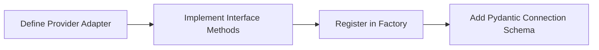

1. **Implement Provider Adapter:**
   Create a new file `backend/app/domains/cloud/adapters/digitalocean.py`.
   Subclass `CloudProviderAdapter` and implement:
   * `connect()`: Initialize the DigitalOcean API client using the wrapper token.
   * `validate()`: Verify API token validity by fetching account details.
   * `fetch_resources()`: Read Droplets, Volumes, and Load Balancers, mapping them to `NormalizedResource` formats.
   * `fetch_costs()`: Pull invoices and project-level billing records.
2. **Register Adapter:**
   Add registration references inside `backend/app/domains/cloud/adapters/factory.py`:
   ```python
   from app.domains.cloud.adapters.digitalocean import DigitalOceanAdapter
   ProviderAdapterFactory.register_adapter("digitalocean", DigitalOceanAdapter)
   ```
3. **Extend DB Schema Verification:**
   Add the provider credentials validation checks into `ConnectionConfig` validation logic inside `backend/app/domains/cloud/schemas.py`.

---

### 14.2 Adding a New Monitoring Provider (e.g. New Relic)

1. **Implement Monitoring Adapter:**
   Create a new adapter `backend/app/domains/monitoring/adapters/new_relic.py` subclassing `MonitoringAdapter`.
2. **Implement Fetch Methods:**
   Use the New Relic GraphQL API (NRQL) to query CPU, memory, and disk usage for resources.
3. **Register Adapter:**
   Add registration references in `backend/app/domains/monitoring/adapters/factory.py`:
   ```python
   from app.domains.monitoring.adapters.new_relic import NewRelicAdapter
   MonitoringFactory.register_adapter("new_relic", NewRelicAdapter)
   ```

---

### 14.3 Extending Kubernetes Support

To support Kubernetes monitoring, follow this pattern:

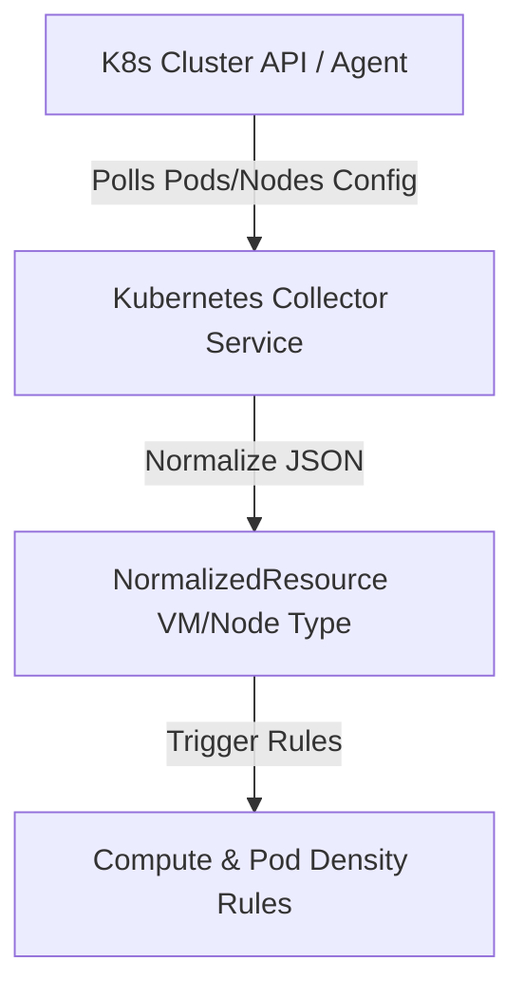

1. **Data Ingestion (Collector):**
   Implement `KubernetesCollector` within `backend/app/domains/kubernetes/collector.py`. The service queries the Kubernetes API using `kubernetes-client` or runs an in-cluster agent.
2. **Data Normalization:**
   * Kubernetes Nodes are mapped to `NormalizedResource` using the `VIRTUAL_MACHINE` type.
   * Kubernetes Pod allocations are saved to database tables to track CPU/Memory limits.
3. **Optimization Rules Extension:**
   Add rules targeting Kubernetes efficiency:
   * **Unused Pod requests:** Compares container request configurations with actual metric usage over time.
   * **Node underutilization:** Identifies underutilized nodes to suggest workload consolidation (Node bin-packing).

---

### 14.4 Replacing or Adding AI LLM Providers

To change or add LLM providers:

1. **Define LLM client interface:**
   Ensure all LLM calls use the `LLMClient` interface:
   ```python
   # File: backend/app/domains/ai/client/base.py
   class LLMClient(ABC):
       @abstractmethod
       async def generate(self, messages: List[Dict[str, str]], temperature: float) -> str:
           pass
   ```
2. **Create New Adapter:**
   To add a provider (e.g., Anthropic directly, or a custom local client), implement a class that subclasses `LLMClient`.
3. **Update Client Factory configuration:**
   Change configuration values in `backend/app/core/config.py` (`settings.AI_PROVIDER`) to load and instantiate the new client adapter without modifying the `AIContextOrchestrator` service.

---

This architecture design provides a production-grade, highly decoupled foundation for the CloudPilot AI DevOps Copilot. It enforces clean abstraction boundaries to ensure the system is scalable, secure, and cloud-agnostic.
