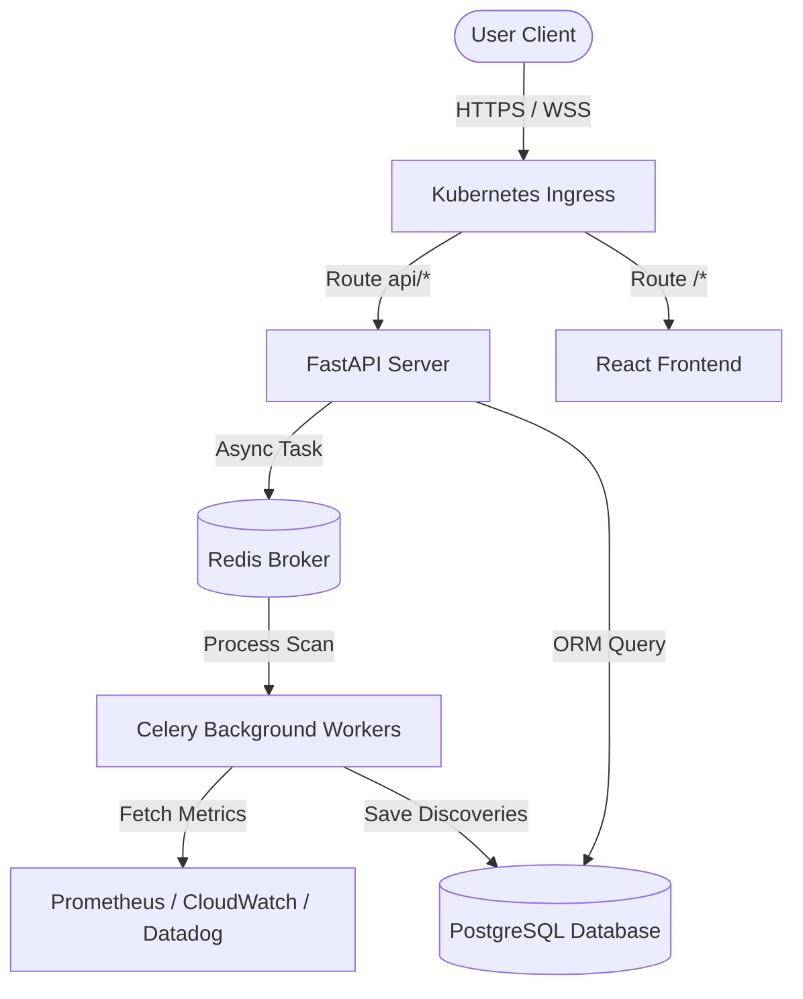
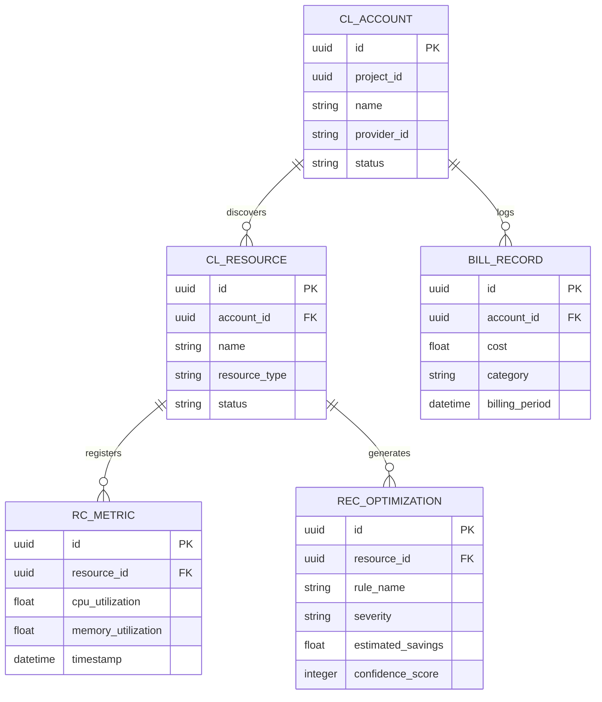
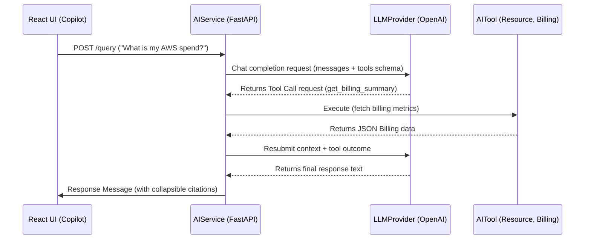
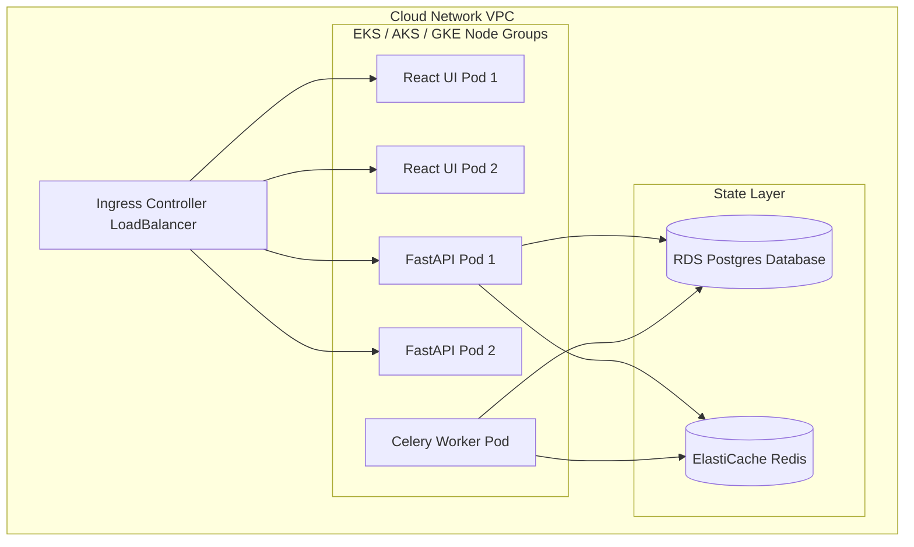

# CloudPilot AI: Architecture & System Design Handbook

This guide contains complete diagrams detailing request flows, class layouts, entity relationships, and deployment architectures.

---

## 1. System Request Flow Diagram

This flow diagram illustrates how user requests route through the system:

---

## 2. Entity Relationship Diagram (ERD)

This entity relationship diagram maps the database schemas and relationships:

---

## 3. Core AI Chat Sequence Diagram

This sequence diagram details how the AI DevOps Copilot executes agent loops:

---

## 4. Kubernetes Deployment Diagram

This deployment diagram maps the target high-availability Kubernetes infrastructure layout:

