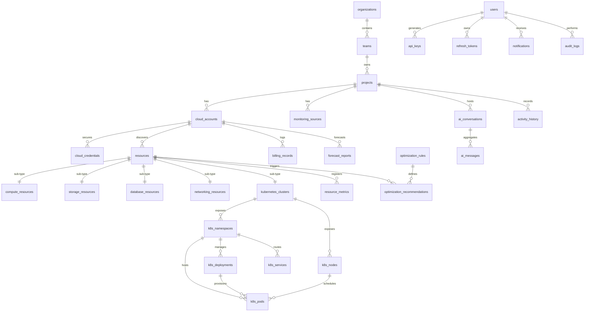

# Database Schema Specification

This document details the PostgreSQL database schema for **CloudPilot AI**.

---

## 1. Soft Delete & Audit Strategy

### Soft Delete Strategy
* **Pattern:** We use a `deleted_at` timestamp field (`TIMESTAMP WITH TIME ZONE NULL`) rather than a boolean flag.
* **Query Scopes:** Application queries must filter on `deleted_at IS NULL` by default.
* **Uniqueness Constraints:** To avoid conflicts when a user soft-deletes a resource and then creates a new one with the same unique identifier, unique indexes must include `(deleted_at)` using `COALESCE(deleted_at, '1970-01-01 00:00:00+00')` or partial indexes like `CREATE UNIQUE INDEX ... WHERE deleted_at IS NULL`. We standardize on **partial indexes** where `deleted_at IS NULL`.

### Audit Strategy
* **Temporal Audits:** An `audit_logs` table records high-importance administrative actions.
* **Row-Level History:** Core transactional tables (`users`, `cloud_accounts`, `optimization_recommendations`) implement row-level state tracking via trigger-based writes to `activity_history`.
* **Standard Fields:** Every record includes `created_at TIMESTAMP WITH TIME ZONE DEFAULT CURRENT_TIMESTAMP` and `updated_at TIMESTAMP WITH TIME ZONE DEFAULT CURRENT_TIMESTAMP`. A PostgreSQL trigger updates `updated_at` on modification.

---

## 2. Entity-Relationship Diagram (Text & Mermaid representation)

---

## 3. Table Schemas & Specifications

### 3.1 Tenancy & Authentication

#### `users`
Represents an identity within the platform.
* **Columns:**
  * `id` `UUID` (Primary Key, Default: `gen_random_uuid()`)
  * `email` `VARCHAR(255)` (NOT NULL, UNIQUE, Lowercase)
  * `password_hash` `VARCHAR(255)` (NOT NULL)
  * `is_active` `BOOLEAN` (NOT NULL, Default: `TRUE`)
  * `created_at` `TIMESTAMPTZ` (NOT NULL, Default: `CURRENT_TIMESTAMP`)
  * `updated_at` `TIMESTAMPTZ` (NOT NULL, Default: `CURRENT_TIMESTAMP`)
* **Constraints:**
  * `check_email_format` CHECK (`email` ~* '^[A-Za-z0-9._%-]+@[A-Za-z0-9.-]+\.[A-Za-z]{2,4}$')
* **Indices:**
  * `idx_users_email` (UNIQUE) on `email`

#### `organizations`
Represents the top-level grouping for enterprise clients.
* **Columns:**
  * `id` `UUID` (Primary Key, Default: `gen_random_uuid()`)
  * `name` `VARCHAR(100)` (NOT NULL)
  * `slug` `VARCHAR(100)` (NOT NULL, UNIQUE)
  * `created_at` `TIMESTAMPTZ` (NOT NULL, Default: `CURRENT_TIMESTAMP`)
  * `updated_at` `TIMESTAMPTZ` (NOT NULL, Default: `CURRENT_TIMESTAMP`)

#### `teams`
Sub-organizational unit grouping users and permissions.
* **Columns:**
  * `id` `UUID` (Primary Key, Default: `gen_random_uuid()`)
  * `organization_id` `UUID` (NOT NULL, Foreign Key references `organizations.id`)
  * `name` `VARCHAR(100)` (NOT NULL)
  * `created_at` `TIMESTAMPTZ` (NOT NULL, Default: `CURRENT_TIMESTAMP`)
  * `updated_at` `TIMESTAMPTZ` (NOT NULL, Default: `CURRENT_TIMESTAMP`)
* **Cascade Rules:**
  * `organization_id`: ON DELETE CASCADE

#### `projects`
Workspaces housing cloud accounts and monitoring configurations.
* **Columns:**
  * `id` `UUID` (Primary Key, Default: `gen_random_uuid()`)
  * `team_id` `UUID` (NOT NULL, Foreign Key references `teams.id`)
  * `name` `VARCHAR(100)` (NOT NULL)
  * `description` `TEXT` (NULL)
  * `created_at` `TIMESTAMPTZ` (NOT NULL, Default: `CURRENT_TIMESTAMP`)
  * `updated_at` `TIMESTAMPTZ` (NOT NULL, Default: `CURRENT_TIMESTAMP`)
* **Cascade Rules:**
  * `team_id`: ON DELETE CASCADE

#### `api_keys`
API credentials for machine-to-machine integrations.
* **Columns:**
  * `id` `UUID` (Primary Key, Default: `gen_random_uuid()`)
  * `user_id` `UUID` (NOT NULL, Foreign Key references `users.id`)
  * `name` `VARCHAR(100)` (NOT NULL)
  * `key_hash` `VARCHAR(64)` (NOT NULL, UNIQUE)  # SHA-256 hash of API key
  * `is_active` `BOOLEAN` (NOT NULL, Default: `TRUE`)
  * `expires_at` `TIMESTAMPTZ` (NULL)
  * `created_at` `TIMESTAMPTZ` (NOT NULL, Default: `CURRENT_TIMESTAMP`)
  * `updated_at` `TIMESTAMPTZ` (NOT NULL, Default: `CURRENT_TIMESTAMP`)
* **Cascade Rules:**
  * `user_id`: ON DELETE CASCADE
* **Indices:**
  * `idx_api_keys_hash` (UNIQUE) on `key_hash`

#### `refresh_tokens`
Stores JWT refresh token hashes to control active sessions.
* **Columns:**
  * `id` `UUID` (Primary Key, Default: `gen_random_uuid()`)
  * `user_id` `UUID` (NOT NULL, Foreign Key references `users.id`)
  * `token_hash` `VARCHAR(64)` (NOT NULL, UNIQUE)
  * `is_revoked` `BOOLEAN` (NOT NULL, Default: `FALSE`)
  * `expires_at` `TIMESTAMPTZ` (NOT NULL)
  * `created_at` `TIMESTAMPTZ` (NOT NULL, Default: `CURRENT_TIMESTAMP`)
* **Cascade Rules:**
  * `user_id`: ON DELETE CASCADE

---

### 3.2 Integrations & Providers

#### `cloud_providers`
Catalog of supported cloud platform engines.
* **Columns:**
  * `id` `VARCHAR(50)` (Primary Key, e.g. 'aws', 'azure', 'gcp', 'digitalocean')
  * `name` `VARCHAR(100)` (NOT NULL)
  * `is_active` `BOOLEAN` (NOT NULL, Default: `TRUE`)
  * `created_at` `TIMESTAMPTZ` (NOT NULL, Default: `CURRENT_TIMESTAMP`)
  * `updated_at` `TIMESTAMPTZ` (NOT NULL, Default: `CURRENT_TIMESTAMP`)

#### `monitoring_providers`
Catalog of supported metric platforms.
* **Columns:**
  * `id` `VARCHAR(50)` (Primary Key, e.g. 'prometheus', 'cloudwatch', 'azure_monitor', 'datadog')
  * `name` `VARCHAR(100)` (NOT NULL)
  * `is_active` `BOOLEAN` (NOT NULL, Default: `TRUE`)
  * `created_at` `TIMESTAMPTZ` (NOT NULL, Default: `CURRENT_TIMESTAMP`)
  * `updated_at` `TIMESTAMPTZ` (NOT NULL, Default: `CURRENT_TIMESTAMP`)

#### `cloud_accounts`
Represents an integration target associated with a specific cloud provider.
* **Columns:**
  * `id` `UUID` (Primary Key, Default: `gen_random_uuid()`)
  * `project_id` `UUID` (NOT NULL, Foreign Key references `projects.id`)
  * `provider_id` `VARCHAR(50)` (NOT NULL, Foreign Key references `cloud_providers.id`)
  * `name` `VARCHAR(100)` (NOT NULL)
  * `account_identifier` `VARCHAR(100)` (NOT NULL)  # e.g. AWS account ID, Azure Subscription ID
  * `status` `VARCHAR(50)` (NOT NULL, Default: 'CONNECTED')  # CONNECTED, DISCONNECTED, DEGRADED
  * `created_at` `TIMESTAMPTZ` (NOT NULL, Default: `CURRENT_TIMESTAMP`)
  * `updated_at` `TIMESTAMPTZ` (NOT NULL, Default: `CURRENT_TIMESTAMP`)
* **Cascade Rules:**
  * `project_id`: ON DELETE CASCADE
  * `provider_id`: ON DELETE RESTRICT
* **Indices:**
  * `idx_cloud_accounts_identifier` on `(provider_id, account_identifier)`

#### `cloud_credentials`
Encrypted connection credentials.
* **Columns:**
  * `id` `UUID` (Primary Key, Default: `gen_random_uuid()`)
  * `cloud_account_id` `UUID` (NOT NULL, Foreign Key references `cloud_accounts.id`, UNIQUE)
  * `encrypted_payload` `TEXT` (NOT NULL)  # AES-256-GCM cipher payload
  * `key_arn` `VARCHAR(255)` (NULL)       # Reference to AWS KMS KEK version
  * `created_at` `TIMESTAMPTZ` (NOT NULL, Default: `CURRENT_TIMESTAMP`)
  * `updated_at` `TIMESTAMPTZ` (NOT NULL, Default: `CURRENT_TIMESTAMP`)
* **Cascade Rules:**
  * `cloud_account_id`: ON DELETE CASCADE

#### `monitoring_sources`
Represents a connection endpoint to a monitoring platform.
* **Columns:**
  * `id` `UUID` (Primary Key, Default: `gen_random_uuid()`)
  * `project_id` `UUID` (NOT NULL, Foreign Key references `projects.id`)
  * `provider_id` `VARCHAR(50)` (NOT NULL, Foreign Key references `monitoring_providers.id`)
  * `name` `VARCHAR(100)` (NOT NULL)
  * `endpoint_url` `VARCHAR(500)` (NOT NULL)
  * `encrypted_credentials` `TEXT` (NOT NULL)
  * `status` `VARCHAR(50)` (NOT NULL, Default: 'ACTIVE')  # ACTIVE, INACTIVE, ERROR
  * `created_at` `TIMESTAMPTZ` (NOT NULL, Default: `CURRENT_TIMESTAMP`)
  * `updated_at` `TIMESTAMPTZ` (NOT NULL, Default: `CURRENT_TIMESTAMP`)
* **Cascade Rules:**
  * `project_id`: ON DELETE CASCADE
  * `provider_id`: ON DELETE RESTRICT

---

### 3.3 Resource Inventory Layer

#### `resources`
Base abstract representation of discovered infrastructure items.
* **Columns:**
  * `id` `UUID` (Primary Key, Default: `gen_random_uuid()`)
  * `cloud_account_id` `UUID` (NOT NULL, Foreign Key references `cloud_accounts.id`)
  * `external_id` `VARCHAR(500)` (NOT NULL)  # ARN, Resource URI
  * `name` `VARCHAR(255)` (NOT NULL)
  * `resource_type` `VARCHAR(50)` (NOT NULL)  # Enums (e.g. virtual_machine)
  * `region` `VARCHAR(100)` (NOT NULL)
  * `status` `VARCHAR(50)` (NOT NULL)
  * `tags` `JSONB` (NOT NULL, Default: `'{}'::jsonb`)
  * `raw_payload` `JSONB` (NOT NULL)
  * `created_at` `TIMESTAMPTZ` (NOT NULL, Default: `CURRENT_TIMESTAMP`)
  * `updated_at` `TIMESTAMPTZ` (NOT NULL, Default: `CURRENT_TIMESTAMP`)
  * `deleted_at` `TIMESTAMPTZ` (NULL)  # Soft Delete Support
* **Cascade Rules:**
  * `cloud_account_id`: ON DELETE CASCADE
* **Indices:**
  * `idx_resources_external_id` UNIQUE on `(cloud_account_id, external_id)` WHERE `deleted_at IS NULL`
  * `idx_resources_tags` USING gin (`tags`)
  * `idx_resources_type` on `resource_type`

#### `compute_resources`
Concrete sub-table containing CPU-bound execution details.
* **Columns:**
  * `resource_id` `UUID` (Primary Key, Foreign Key references `resources.id` ON DELETE CASCADE)
  * `instance_type` `VARCHAR(100)` (NOT NULL)
  * `vcpu_count` `INT` (NOT NULL)
  * `memory_gb` `NUMERIC(10,2)` (NOT NULL)
  * `operating_system` `VARCHAR(100)` (NOT NULL)
  * `lifecycle` `VARCHAR(50)` (NOT NULL)  # ON_DEMAND, SPOT, RESERVED

#### `storage_resources`
Storage allocations.
* **Columns:**
  * `resource_id` `UUID` (Primary Key, Foreign Key references `resources.id` ON DELETE CASCADE)
  * `size_gb` `NUMERIC(12,2)` (NOT NULL)
  * `storage_type` `VARCHAR(100)` (NOT NULL)  # gp3, StandardSSD, PremiumLRS
  * `iops` `INT` (NULL)
  * `throughput_mbps` `INT` (NULL)
  * `encrypted` `BOOLEAN` (NOT NULL, Default: `FALSE`)

#### `database_resources`
PaaS / Managed DB instances.
* **Columns:**
  * `resource_id` `UUID` (Primary Key, Foreign Key references `resources.id` ON DELETE CASCADE)
  * `engine` `VARCHAR(100)` (NOT NULL)  # Postgres, MySQL, Oracle
  * `engine_version` `VARCHAR(50)` (NOT NULL)
  * `instance_class` `VARCHAR(100)` (NOT NULL)
  * `multi_az` `BOOLEAN` (NOT NULL, Default: `FALSE`)
  * `storage_size_gb` `NUMERIC(10,2)` (NOT NULL)

#### `networking_resources`
Network components (Load balancers, Gateways, NAT).
* **Columns:**
  * `resource_id` `UUID` (Primary Key, Foreign Key references `resources.id` ON DELETE CASCADE)
  * `vpc_id` `VARCHAR(255)` (NULL)
  * `cidr_block` `VARCHAR(50)` (NULL)
  * `public_ip` `VARCHAR(45)` (NULL)
  * `load_balancer_type` `VARCHAR(50)` (NULL)  # ALB, NLB, Classic

---

### 3.4 Kubernetes Resources Layer

#### `kubernetes_clusters`
Root Kubernetes component mapped to base resources.
* **Columns:**
  * `resource_id` `UUID` (Primary Key, Foreign Key references `resources.id` ON DELETE CASCADE)
  * `version` `VARCHAR(50)` (NOT NULL)
  * `endpoint` `VARCHAR(255)` (NOT NULL)
  * `status` `VARCHAR(50)` (NOT NULL)

#### `k8s_namespaces`
* **Columns:**
  * `id` `UUID` (Primary Key, Default: `gen_random_uuid()`)
  * `cluster_id` `UUID` (NOT NULL, Foreign Key references `kubernetes_clusters.resource_id` ON DELETE CASCADE)
  * `name` `VARCHAR(253)` (NOT NULL)
  * `created_at` `TIMESTAMPTZ` (NOT NULL, Default: `CURRENT_TIMESTAMP`)
  * `updated_at` `TIMESTAMPTZ` (NOT NULL, Default: `CURRENT_TIMESTAMP`)
* **Indices:**
  * `idx_k8s_ns_cluster` UNIQUE on `(cluster_id, name)`

#### `k8s_nodes`
Node systems running in the target cluster.
* **Columns:**
  * `id` `UUID` (Primary Key, Default: `gen_random_uuid()`)
  * `cluster_id` `UUID` (NOT NULL, Foreign Key references `kubernetes_clusters.resource_id` ON DELETE CASCADE)
  * `name` `VARCHAR(253)` (NOT NULL)
  * `instance_type` `VARCHAR(100)` (NULL)
  * `provider_id` `VARCHAR(255)` (NULL)  # Links back to Resource ID if running as a Cloud VM
  * `status` `VARCHAR(50)` (NOT NULL)
  * `created_at` `TIMESTAMPTZ` (NOT NULL, Default: `CURRENT_TIMESTAMP`)
  * `updated_at` `TIMESTAMPTZ` (NOT NULL, Default: `CURRENT_TIMESTAMP`)
* **Indices:**
  * `idx_k8s_node_cluster` UNIQUE on `(cluster_id, name)`

#### `k8s_deployments`
Deployment manifests.
* **Columns:**
  * `id` `UUID` (Primary Key, Default: `gen_random_uuid()`)
  * `namespace_id` `UUID` (NOT NULL, Foreign Key references `k8s_namespaces.id` ON DELETE CASCADE)
  * `name` `VARCHAR(253)` (NOT NULL)
  * `replicas` `INT` (NOT NULL, Default: `1`)
  * `available_replicas` `INT` (NOT NULL, Default: `0`)
  * `created_at` `TIMESTAMPTZ` (NOT NULL, Default: `CURRENT_TIMESTAMP`)
  * `updated_at` `TIMESTAMPTZ` (NOT NULL, Default: `CURRENT_TIMESTAMP`)
* **Indices:**
  * `idx_k8s_deploy_ns` UNIQUE on `(namespace_id, name)`

#### `k8s_pods`
Individual runtime pods.
* **Columns:**
  * `id` `UUID` (Primary Key, Default: `gen_random_uuid()`)
  * `namespace_id` `UUID` (NOT NULL, Foreign Key references `k8s_namespaces.id` ON DELETE CASCADE)
  * `deployment_id` `UUID` (NULL, Foreign Key references `k8s_deployments.id` ON DELETE SET NULL)
  * `node_id` `UUID` (NULL, Foreign Key references `k8s_nodes.id` ON DELETE SET NULL)
  * `name` `VARCHAR(253)` (NOT NULL)
  * `status` `VARCHAR(50)` (NOT NULL)  # Running, Pending, Failed
  * `cpu_request` `NUMERIC(6,3)` (NULL)  # cores
  * `cpu_limit` `NUMERIC(6,3)` (NULL)
  * `memory_request` `NUMERIC(10,2)` (NULL)  # MB
  * `memory_limit` `NUMERIC(10,2)` (NULL)
  * `created_at` `TIMESTAMPTZ` (NOT NULL, Default: `CURRENT_TIMESTAMP`)
  * `updated_at` `TIMESTAMPTZ` (NOT NULL, Default: `CURRENT_TIMESTAMP`)
* **Indices:**
  * `idx_k8s_pod_ns` UNIQUE on `(namespace_id, name)`
  * `idx_k8s_pod_node` on `node_id`

#### `k8s_services`
Cluster services.
* **Columns:**
  * `id` `UUID` (Primary Key, Default: `gen_random_uuid()`)
  * `namespace_id` `UUID` (NOT NULL, Foreign Key references `k8s_namespaces.id` ON DELETE CASCADE)
  * `name` `VARCHAR(253)` (NOT NULL)
  * `service_type` `VARCHAR(50)` (NOT NULL)  # ClusterIP, NodePort, LoadBalancer
  * `cluster_ip` `VARCHAR(45)` (NULL)
  * `external_ip` `VARCHAR(45)` (NULL)
  * `created_at` `TIMESTAMPTZ` (NOT NULL, Default: `CURRENT_TIMESTAMP`)
  * `updated_at` `TIMESTAMPTZ` (NOT NULL, Default: `CURRENT_TIMESTAMP`)

---

### 3.5 Billing, Metrics & Forecaster

#### `billing_records`
Continuous cost exports from billing engines.
* **Columns:**
  * `id` `UUID` (Primary Key, Default: `gen_random_uuid()`)
  * `cloud_account_id` `UUID` (NOT NULL, Foreign Key references `cloud_accounts.id` ON DELETE CASCADE)
  * `resource_id` `UUID` (NULL, Foreign Key references `resources.id` ON DELETE SET NULL)
  * `usage_start` `TIMESTAMPTZ` (NOT NULL)
  * `usage_end` `TIMESTAMPTZ` (NOT NULL)
  * `cost` `NUMERIC(15,6)` (NOT NULL)  # Up to 6 decimals accuracy
  * `currency` `VARCHAR(3)` (NOT NULL, Default: 'USD')
  * `usage_type` `VARCHAR(100)` (NOT NULL)
  * `category` `VARCHAR(50)` (NOT NULL)  # Compute, Storage, DataTransfer, Database
  * `raw_billing_payload` `JSONB` (NOT NULL)
  * `created_at` `TIMESTAMPTZ` (NOT NULL, Default: `CURRENT_TIMESTAMP`)
* **Indices:**
  * `idx_billing_records_date` on `(cloud_account_id, usage_start, usage_end)`
  * `idx_billing_records_resource` on `resource_id` WHERE `resource_id IS NOT NULL`

#### `pricing_records`
Normalized reference library lookup table.
* **Columns:**
  * `id` `UUID` (Primary Key, Default: `gen_random_uuid()`)
  * `provider_id` `VARCHAR(50)` (NOT NULL, Foreign Key references `cloud_providers.id` ON DELETE RESTRICT)
  * `sku` `VARCHAR(100)` (NOT NULL)
  * `service_code` `VARCHAR(100)` (NOT NULL)
  * `region` `VARCHAR(100)` (NOT NULL)
  * `resource_specification` `JSONB` (NOT NULL)
  * `unit_price_hourly` `NUMERIC(15,6)` (NOT NULL)
  * `currency` `VARCHAR(3)` (NOT NULL, Default: 'USD')
  * `created_at` `TIMESTAMPTZ` (NOT NULL, Default: `CURRENT_TIMESTAMP`)
  * `updated_at` `TIMESTAMPTZ` (NOT NULL, Default: `CURRENT_TIMESTAMP`)
* **Indices:**
  * `idx_pricing_lookup` UNIQUE on `(provider_id, sku, region)`

#### `resource_metrics`
Time-series measurements. **Partitioned by Month** on the `timestamp` column.
* **Columns:**
  * `id` `BIGSERIAL` (NOT NULL)
  * `resource_id` `UUID` (NOT NULL, Foreign Key references `resources.id` ON DELETE CASCADE)
  * `metric_type` `VARCHAR(50)` (NOT NULL)
  * `timestamp` `TIMESTAMPTZ` (NOT NULL)
  * `value` `DOUBLE PRECISION` (NOT NULL)
  * `unit` `VARCHAR(20)` (NOT NULL)
* **PK Definition:** Primary Key is `(id, timestamp)` to support PostgreSQL partitioning layouts.
* **Indices:**
  * `idx_metrics_query` on `(resource_id, metric_type, timestamp DESC)`

---

### 3.6 Optimization & Rules

#### `optimization_rules`
Defines operational parameters and configurations for engine rules.
* **Columns:**
  * `id` `VARCHAR(100)` (Primary Key, e.g. 'idle_vm', 'unused_storage')
  * `name` `VARCHAR(200)` (NOT NULL)
  * `description` `TEXT` (NOT NULL)
  * `is_active` `BOOLEAN` (NOT NULL, Default: `TRUE`)
  * `threshold_config` `JSONB` (NOT NULL, Default: `'{}'::jsonb`)
  * `created_at` `TIMESTAMPTZ` (NOT NULL, Default: `CURRENT_TIMESTAMP`)
  * `updated_at` `TIMESTAMPTZ` (NOT NULL, Default: `CURRENT_TIMESTAMP`)

#### `optimization_recommendations`
Actionable opportunities created by the engine.
* **Columns:**
  * `id` `UUID` (Primary Key, Default: `gen_random_uuid()`)
  * `resource_id` `UUID` (NOT NULL, Foreign Key references `resources.id` ON DELETE CASCADE)
  * `rule_id` `VARCHAR(100)` (NOT NULL, Foreign Key references `optimization_rules.id` ON DELETE RESTRICT)
  * `recommendation_type` `VARCHAR(50)` (NOT NULL)  # rightsize, terminate, tier_migration
  * `savings_potential_monthly` `NUMERIC(12,2)` (NOT NULL)
  * `current_configuration` `JSONB` (NOT NULL)
  * `target_configuration` `JSONB` (NOT NULL)
  * `status` `VARCHAR(50)` (NOT NULL, Default: 'ACTIVE')  # ACTIVE, APPLIED, DISMISSED, STALE
  * `reasoning` `TEXT` (NOT NULL)
  * `created_at` `TIMESTAMPTZ` (NOT NULL, Default: `CURRENT_TIMESTAMP`)
  * `updated_at` `TIMESTAMPTZ` (NOT NULL, Default: `CURRENT_TIMESTAMP`)
  * `resolved_at` `TIMESTAMPTZ` (NULL)
* **Indices:**
  * `idx_recs_status` on `(resource_id, status)`

#### `forecast_reports`
Machine Learning generated forecast logs.
* **Columns:**
  * `id` `UUID` (Primary Key, Default: `gen_random_uuid()`)
  * `project_id` `UUID` (NOT NULL, Foreign Key references `projects.id` ON DELETE CASCADE)
  * `cloud_account_id` `UUID` (NULL, Foreign Key references `cloud_accounts.id` ON DELETE CASCADE)
  * `forecast_type` `VARCHAR(50)` (NOT NULL)  # cost, usage
  * `baseline_cost` `NUMERIC(15,2)` (NOT NULL)
  * `optimistic_cost` `NUMERIC(15,2)` (NOT NULL)
  * `pessimistic_cost` `NUMERIC(15,2)` (NOT NULL)
  * `forecast_data` `JSONB` (NOT NULL)  # Array of points containing predictions
  * `start_date` `DATE` (NOT NULL)
  * `end_date` `DATE` (NOT NULL)
  * `created_at` `TIMESTAMPTZ` (NOT NULL, Default: `CURRENT_TIMESTAMP`)

---

### 3.7 Collaboration & AI Assistant

#### `ai_conversations`
Persistent AI assistant chat sessions.
* **Columns:**
  * `id` `UUID` (Primary Key, Default: `gen_random_uuid()`)
  * `project_id` `UUID` (NOT NULL, Foreign Key references `projects.id` ON DELETE CASCADE)
  * `user_id` `UUID` (NOT NULL, Foreign Key references `users.id` ON DELETE CASCADE)
  * `title` `VARCHAR(200)` (NOT NULL, Default: 'New Chat Session')
  * `created_at` `TIMESTAMPTZ` (NOT NULL, Default: `CURRENT_TIMESTAMP`)
  * `updated_at` `TIMESTAMPTZ` (NOT NULL, Default: `CURRENT_TIMESTAMP`)

#### `ai_messages`
Messages mapping to conversations.
* **Columns:**
  * `id` `UUID` (Primary Key, Default: `gen_random_uuid()`)
  * `conversation_id` `UUID` (NOT NULL, Foreign Key references `ai_conversations.id` ON DELETE CASCADE)
  * `role` `VARCHAR(50)` (NOT NULL)  # user, assistant, system
  * `content` `TEXT` (NOT NULL)
  * `tokens_used` `INT` (NULL)
  * `created_at` `TIMESTAMPTZ` (NOT NULL, Default: `CURRENT_TIMESTAMP`)
* **Indices:**
  * `idx_ai_messages_conv` on `(conversation_id, created_at ASC)`

---

### 3.8 Administration & Operations

#### `notifications`
Alert notification logs.
* **Columns:**
  * `id` `UUID` (Primary Key, Default: `gen_random_uuid()`)
  * `user_id` `UUID` (NOT NULL, Foreign Key references `users.id` ON DELETE CASCADE)
  * `notification_type` `VARCHAR(50)` (NOT NULL)  # resource_alert, optimization_ready, billing_spike
  * `title` `VARCHAR(255)` (NOT NULL)
  * `message` `TEXT` (NOT NULL)
  * `is_read` `BOOLEAN` (NOT NULL, Default: `FALSE`)
  * `created_at` `TIMESTAMPTZ` (NOT NULL, Default: `CURRENT_TIMESTAMP`)
* **Indices:**
  * `idx_notifications_user_read` on `(user_id, is_read)`

#### `scheduled_jobs`
System job tracking and heartbeat management.
* **Columns:**
  * `id` `UUID` (Primary Key, Default: `gen_random_uuid()`)
  * `job_name` `VARCHAR(150)` (NOT NULL, UNIQUE)  # discover_resources, run_optimizer
  * `schedule_expression` `VARCHAR(100)` (NOT NULL)  # Cron format
  * `last_run_at` `TIMESTAMPTZ` (NULL)
  * `next_run_at` `TIMESTAMPTZ` (NULL)
  * `status` `VARCHAR(50)` (NOT NULL, Default: 'IDLE')  # IDLE, RUNNING, FAILED, DEGRADED
  * `error_log` `TEXT` (NULL)
  * `updated_at` `TIMESTAMPTZ` (NOT NULL, Default: `CURRENT_TIMESTAMP`)

#### `audit_logs`
* **Columns:**
  * `id` `UUID` (Primary Key, Default: `gen_random_uuid()`)
  * `user_id` `UUID` (NULL, Foreign Key references `users.id` ON DELETE SET NULL)
  * `action` `VARCHAR(100)` (NOT NULL)  # login, disconnect_cloud, modify_rbac
  * `ip_address` `INET` (NOT NULL)
  * `request_payload` `JSONB` (NULL)  # Masked fields
  * `user_agent` `VARCHAR(255)` (NULL)
  * `created_at` `TIMESTAMPTZ` (NOT NULL, Default: `CURRENT_TIMESTAMP`)
* **Indices:**
  * `idx_audit_logs_user` on `user_id`
  * `idx_audit_logs_action` on `action`

#### `system_settings`
Global deployment options.
* **Columns:**
  * `id` `UUID` (Primary Key, Default: `gen_random_uuid()`)
  * `key` `VARCHAR(100)` (NOT NULL, UNIQUE)
  * `value` `JSONB` (NOT NULL)
  * `created_at` `TIMESTAMPTZ` (NOT NULL, Default: `CURRENT_TIMESTAMP`)
  * `updated_at` `TIMESTAMPTZ` (NOT NULL, Default: `CURRENT_TIMESTAMP`)

#### `activity_history`
History streams logging operational updates.
* **Columns:**
  * `id` `UUID` (Primary Key, Default: `gen_random_uuid()`)
  * `project_id` `UUID` (NOT NULL, Foreign Key references `projects.id` ON DELETE CASCADE)
  * `entity_type` `VARCHAR(100)` (NOT NULL)  # cloud_account, recommendation
  * `entity_id` `UUID` (NOT NULL)
  * `description` `TEXT` (NOT NULL)
  * `user_id` `UUID` (NULL, Foreign Key references `users.id` ON DELETE SET NULL)
  * `created_at` `TIMESTAMPTZ` (NOT NULL, Default: `CURRENT_TIMESTAMP`)
* **Indices:**
  * `idx_activity_project` on `(project_id, created_at DESC)`
